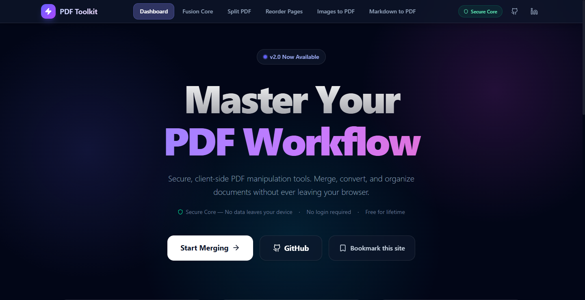

# PDF Merger Frontend

A **free**, privacy-focused, and **no-login** client-side PDF toolkit built with React, Vite, and pdf-lib.

🚀 **Live Demo:** [https://pdf-toolkit.vasanthubs.co.in/](https://pdf-toolkit.vasanthubs.co.in/)

📦 **Repository:** [https://github.com/techVasanthsmart/pdf-toolkit](https://github.com/techVasanthsmart/pdf-toolkit)



## Features

- **Pure Client-Side**: All merging happens in your browser. No files are uploaded to any server.
- **100% Free**: No hidden costs, free for lifetime.
- **No Login Required**: Immediate access to all tools.
- **Drag & Drop**: Easily add files by dragging them onto the interface.
- **Reorder**: Drag file cards to change the merge order.
- **Instant Merge**: Fast processing using WebAssembly-powered libraries.
- **Modern UI**: Glassmorphism design with smooth animations.

## Setup

1. Install dependencies:

   ```bash
   npm install
   ```

2. Start the development server:

   ```bash
   npm run dev
   ```

3. Build for production:
   ```bash
   npm run build
   ```

## Analytics & SEO

- **Google Analytics 4 (GA4)** – Optional. Set `VITE_GA_MEASUREMENT_ID` in your environment (e.g. in a `.env` file) to enable page view and event tracking. The app tracks route changes for SPAs automatically.
- SEO meta tags, Open Graph, Twitter Card, and JSON-LD structured data are handled in the app.

## Technologies

- React + Vite
- pdf-lib (PDF manipulation)
- @hello-pangea/dnd (Drag and drop)
- Lucide React (Icons)
- Framer Motion (Animations)
- react-ga4 (Google Analytics 4)
